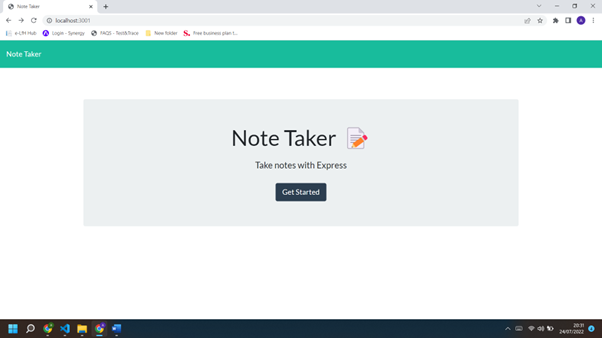

# note-taking-app

# Note-Taker-Express.js

# Description
This application is used to write and save notes. It uses Express.js back end and will save and retrieve note data from a JSON file.

Table of content
Installation
Usage
License
Contributing
Tests
Technology used
Questions
Installation
Clone the code from Github
Install npm and all dependencies (express)
Usage
Install npm: npm init -y
Install express: npm i express
Go to deployed link via Heroku (found below)
Click "Get Started" to go to the main note taker page
Write both a note and note text below, then hit the save button on the top right corner
You can add more notes by hitting the "+" sign in the top right corner
You can delete notes by hitting the trash icon beside the note you want to delete

#Technology
. HTML

. CSS

. JavaScript

. Node.js

. Bootstrap

. Express.js

. JSON

. Heroku

## Installation

Open terminal and install node modules using the following command `npm i`

Enter `node server.js` in terminal to start the application. Once a port has been presented in terminal then type `localhost:3000` into browser to display the application locally. Alternatively, use the Heroku link provided in the links section below.

## Deployed Application
https://morning-thicket-57382.herokuapp.com/notes

https://github.com/aali9/note-taking-app

#demo 

